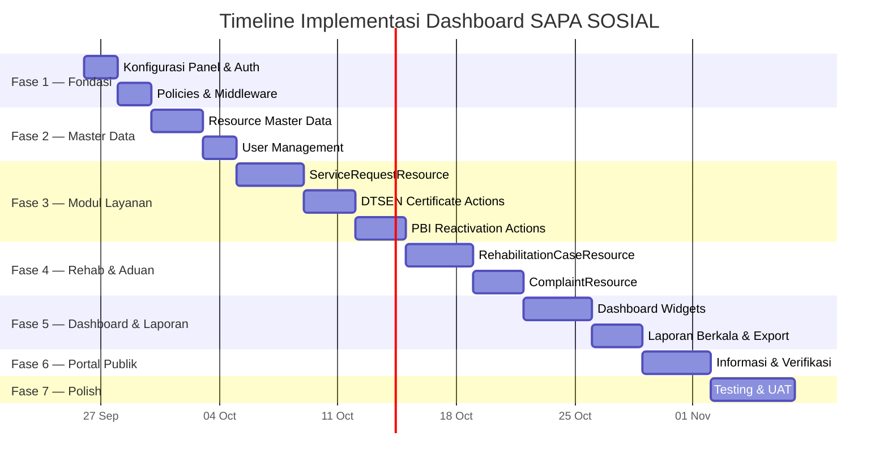
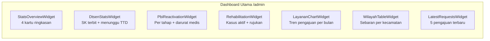

# 🚀 Rencana Aksi — Dashboard SAPA SOSIAL (Filament v5)

> **Stack:** Laravel 13 · Filament v5.8 · Livewire v4 · PostgreSQL · spatie/laravel-permission · spatie/laravel-activitylog

---

## Peta Jalan Implementasi



---

## Fase 1 — Fondasi Panel & Autentikasi

### 1.1 Konfigurasi AdminPanelProvider

**File:** [`AdminPanelProvider.php`](file:///c:/laragon/www/app-layanan/app/Providers/Filament/AdminPanelProvider.php)

Konfigurasi yang perlu ditambahkan:

```php
return $panel
    ->default()
    ->id('admin')
    ->path('admin')
    ->login()
    ->profile()                         // Halaman profil user
    ->brandName('SAPA SOSIAL')
    ->brandLogo(asset('images/logo.svg'))
    ->favicon(asset('favicon.ico'))
    ->colors([
        'primary' => Color::Indigo,     // Warna utama instansi
        'danger'  => Color::Rose,
        'warning' => Color::Amber,
        'success' => Color::Emerald,
        'info'    => Color::Sky,
    ])
    ->font('Inter')
    ->sidebarCollapsibleOnDesktop()
    ->globalSearch()                     // Pencarian global di header
    ->globalSearchKeyBindings(['command+k', 'ctrl+k'])
    ->databaseNotifications()           // Notifikasi dari DB
    ->databaseNotificationsPolling('30s')
    ->navigationGroups([
        NavigationGroup::make('Layanan')
            ->icon('heroicon-o-clipboard-document-list'),
        NavigationGroup::make('Rehabilitasi')
            ->icon('heroicon-o-heart'),
        NavigationGroup::make('Pengaduan')
            ->icon('heroicon-o-megaphone'),
        NavigationGroup::make('Informasi')
            ->icon('heroicon-o-information-circle'),
        NavigationGroup::make('Master Data')
            ->icon('heroicon-o-cog-6-tooth')
            ->collapsed(),
        NavigationGroup::make('Pengguna')
            ->icon('heroicon-o-users')
            ->collapsed(),
    ])
    ->plugins([
        \Filament\SpatieLaravelPermissionPlugin\SpatieLaravelPermissionPlugin::make(),
    ]);
```

### 1.2 Middleware & Gate

| Task | Detail |
|------|--------|
| Registrasi Spatie | `Gate::before()` di `AppServiceProvider` → Super Admin bypass semua permission |
| Custom Middleware | `EnsureEmailIsVerified` opsional untuk keamanan ekstra |
| Panel Access | `->canAccess()` di panel — hanya user dengan role `admin`, `petugas`, `penandatangan`, `pimpinan`, `operator` |

### 1.3 Policies

Buat Policy untuk **setiap Resource** yang memerlukan pembatasan akses:

| Policy | Model | Aturan Akses |
|--------|-------|--------------|
| `ServiceRequestPolicy` | `ServiceRequest` | Admin & Petugas: CRUD. Operator: Create + View wilayahnya. Pimpinan: View only |
| `DtsenCertificatePolicy` | `DtsenCertificate` | Penandatangan: approve/reject. Petugas: create/edit |
| `PbiReactivationPolicy` | `PbiReactivation` | Penandatangan: approve. Petugas: create/edit/update status |
| `RehabilitationCasePolicy` | `RehabilitationCase` | Hanya petugas rehab yang ditugaskan + Admin + Pimpinan (summary) |
| `ComplaintPolicy` | `Complaint` | Admin & Petugas: CRUD. Operator: Create + View wilayahnya |
| `InformationPagePolicy` | `InformationPage` | Admin: full. Petugas tertentu: edit konten |
| `UserPolicy` | `User` | Hanya Admin |

**Scoping Wilayah** — Operator Kecamatan/Desa hanya melihat data sesuai `village_id`/`district_id` yang terasosiasi di `users`:

```php
// Dalam setiap Resource yang perlu scoping wilayah
public static function getEloquentQuery(): Builder
{
    $query = parent::getEloquentQuery();

    if (auth()->user()->hasRole('operator_kecamatan')) {
        $query->whereHas('village', fn ($q) =>
            $q->where('district_id', auth()->user()->district_id)
        );
    }

    if (auth()->user()->hasRole('operator_desa')) {
        $query->where('village_id', auth()->user()->village_id);
    }

    return $query;
}
```

---

## Fase 2 — Resource Master Data & User Management

### 2.1 Daftar Resource Master Data

| # | Resource | Model | Navigasi | Fitur Utama |
|---|----------|-------|----------|-------------|
| 1 | `DistrictResource` | `District` | Master Data | List, Create, Edit. Import dari Excel |
| 2 | `VillageResource` | `Village` | Master Data | List, Create, Edit. Filter by Kecamatan |
| 3 | `WorkUnitResource` | `WorkUnit` | Master Data | CRUD sederhana |
| 4 | `ServiceTypeResource` | `ServiceType` | Master Data | CRUD + kelola `ServiceRequirement` via RelationManager |
| 5 | `DtsenPurposeResource` | `DtsenPurpose` | Master Data | CRUD + setting batas desil & masa berlaku |
| 6 | `ComplaintCategoryResource` | `ComplaintCategory` | Master Data | CRUD sederhana |
| 7 | `ClientCategoryResource` | `ClientCategory` | Master Data | CRUD sederhana |
| 8 | `ReferralInstitutionResource` | `ReferralInstitution` | Master Data | CRUD + kontak |

### 2.2 UserResource (Pengguna)

**File:** `app/Filament/Resources/UserResource.php`

| Aspek | Implementasi |
|-------|-------------|
| **Table Columns** | `name`, `email`, `roles` (badge), `district` (operator), `village` (operator), `is_active` (toggle), `created_at` |
| **Filters** | Role, Status aktif, Kecamatan |
| **Form** | Name, Email, Password (hashed), Role multi-select, District/Village (visible hanya jika role operator) |
| **Actions** | Toggle Aktif, Impersonate (Admin only) |
| **Bulk Actions** | Assign Role, Deactivate |

---

## Fase 3 — Modul Layanan Utama

### 3.1 ServiceRequestResource (Pengajuan Layanan)

**File:** `app/Filament/Resources/ServiceRequestResource.php`

#### Table Definition

```php
public static function table(Table $table): Table
{
    return $table
        ->columns([
            TextColumn::make('ticket_number')
                ->label('No. Tiket')
                ->searchable()
                ->sortable()
                ->copyable(),
            TextColumn::make('serviceType.name')
                ->label('Jenis Layanan')
                ->badge(),
            TextColumn::make('applicant_name')
                ->label('Pemohon')
                ->searchable(),
            TextColumn::make('applicant_nik')
                ->label('NIK')
                ->searchable()
                ->toggleable(isToggledHiddenByDefault: true),
            TextColumn::make('village.name')
                ->label('Desa/Kelurahan'),
            TextColumn::make('village.district.name')
                ->label('Kecamatan'),
            TextColumn::make('status')
                ->badge()
                ->color(fn (ServiceRequestStatus $state) => match($state) {
                    ServiceRequestStatus::Submitted => 'warning',
                    ServiceRequestStatus::DocumentCheck => 'info',
                    ServiceRequestStatus::RevisionRequested => 'danger',
                    ServiceRequestStatus::Completed => 'success',
                    ServiceRequestStatus::Rejected => 'danger',
                    default => 'primary',
                }),
            TextColumn::make('officer.name')
                ->label('Petugas'),
            TextColumn::make('submitted_at')
                ->label('Tgl Pengajuan')
                ->dateTime('d M Y H:i')
                ->sortable(),
        ])
        ->defaultSort('submitted_at', 'desc')
        ->filters([
            SelectFilter::make('service_type_id')
                ->label('Jenis Layanan')
                ->relationship('serviceType', 'name'),
            SelectFilter::make('status')
                ->options(ServiceRequestStatus::class),
            SelectFilter::make('district')
                ->label('Kecamatan')
                ->relationship('village.district', 'name'),
            Filter::make('submitted_at')
                ->form([
                    DatePicker::make('from')->label('Dari'),
                    DatePicker::make('until')->label('Sampai'),
                ])
                ->query(fn (Builder $query, array $data) =>
                    $query
                        ->when($data['from'], fn ($q, $d) => $q->whereDate('submitted_at', '>=', $d))
                        ->when($data['until'], fn ($q, $d) => $q->whereDate('submitted_at', '<=', $d))
                ),
        ])
        ->filtersFormColumns(3)
        ->actions([
            Tables\Actions\ViewAction::make(),
            Tables\Actions\EditAction::make(),
        ])
        ->bulkActions([
            ExportBulkAction::make(),
        ]);
}
```

#### Form (Schema)

```php
public static function form(Form $form): Form
{
    return $form
        ->schema([
            Section::make('Data Pemohon')
                ->columns(2)
                ->schema([
                    TextInput::make('applicant_name')->label('Nama Pemohon')->required(),
                    TextInput::make('applicant_nik')->label('NIK')
                        ->mask('9999999999999999')->length(16)->required(),
                    TextInput::make('applicant_kk_number')->label('No. KK')
                        ->mask('9999999999999999')->length(16)->required(),
                    TextInput::make('applicant_phone')->label('No. HP')->tel(),
                    Textarea::make('applicant_address')->label('Alamat')->columnSpanFull(),
                    Select::make('village_id')->label('Desa/Kelurahan')
                        ->relationship('village', 'name')
                        ->searchable()->preload()->required(),
                ]),
            Section::make('Detail Pengajuan')
                ->schema([
                    Select::make('service_type_id')->label('Jenis Layanan')
                        ->relationship('serviceType', 'name')
                        ->required()->reactive(),
                    Textarea::make('notes')->label('Catatan/Keterangan'),
                ]),
            Section::make('Dokumen Persyaratan')
                ->schema([
                    Repeater::make('documents')
                        ->relationship('documents')
                        ->schema([
                            Select::make('requirement_id')
                                ->label('Jenis Dokumen')
                                ->relationship('requirement', 'name'),
                            FileUpload::make('file_path')
                                ->label('File')
                                ->disk('local')
                                ->directory('service-documents')
                                ->acceptedFileTypes(['application/pdf', 'image/*'])
                                ->maxSize(5120),
                        ])
                        ->columns(2),
                ]),
        ]);
}
```

#### Relation Managers

| RelationManager | Relasi | Deskripsi |
|-----------------|--------|-----------|
| `DocumentsRelationManager` | `documents` → `ServiceRequestDocument` | Kelola dokumen persyaratan |
| `StatusHistoriesRelationManager` | `statusHistories` (morphMany) → `StatusHistory` | Timeline perubahan status (read-only) |
| `DispositionsRelationManager` | `dispositions` (morphMany) → `Disposition` | Riwayat disposisi |
| `DtsenCertificateRelationManager` | `dtsenCertificate` (hasOne) | Khusus layanan DTSEN |
| `PbiReactivationRelationManager` | `pbiReactivation` (hasOne) | Khusus layanan PBI-JK |

#### Custom Actions (Status Transitions)

| Action | Trigger | Target Status | Validasi |
|--------|---------|---------------|----------|
| `VerifyDocuments` | Petugas | `document_check` → `data_verification` / `eligibility_verification` / `verification` | Semua dokumen wajib ter-upload |
| `RequestRevision` | Petugas | `document_check` → `revision_requested` | Wajib isi alasan revisi |
| `VerifyData` | Petugas | `data_verification` → `awaiting_approval` (DTSEN) | Hasil cek SIKS-NG wajib diisi |
| `SubmitForApproval` | Petugas | → `awaiting_approval` | Data lengkap |
| `ApproveRequest` | Penandatangan | `awaiting_approval` → `issued` / `recommendation_issued` | Wajib paraf/tanda tangan digital |
| `RejectRequest` | Penandatangan/Petugas | → `rejected` | Wajib isi alasan penolakan |
| `MarkCompleted` | Petugas | → `completed` | Hasil layanan tercatat |

> [!IMPORTANT]
> Setiap action harus membuat record baru di `StatusHistory` via polymorphic relation, mencatat `user_id`, `from_status`, `to_status`, dan `notes`.

### 3.2 DTSEN Certificate — Sub-modul ServiceRequest

**Komponen khusus di dalam `ServiceRequestResource`:**

| Komponen | Implementasi |
|----------|-------------|
| **Form Section** "Data DTSEN" | Visible hanya jika `service_type.handler = 'dtsen'`. Fields: `subject_name`, `subject_nik`, `relationship_to_applicant`, `purpose_id`, `purpose_notes` |
| **Form Section** "Hasil Cek SIKS-NG" | Fields: `is_registered_dtsen` (toggle), `decile` (1-10), `siks_ng_checked_at`, `siks_ng_checker_id`. Validasi desil ≤ batas tujuan |
| **Action** "Buat Draf Surat" | Generate `certificate_number` via `NumberSequence`, buat record `DtsenCertificate`, generate PDF + QR code |
| **Action** "Paraf Kabid" | Buat `Approval` record, decision = `approved/returned` |
| **Action** "Tanda Tangan Kadis" | Buat `Approval` record, finalisasi surat, generate PDF final |
| **Infolist Section** "Surat Terbit" | Tampilkan PDF preview, nomor surat, QR, tombol download |

**Duplikasi Warning:**

```php
// Di form, setelah subject_nik & purpose_id diisi
TextInput::make('subject_nik')
    ->afterStateUpdated(function ($state, $set, $get) {
        $duplicate = DtsenCertificate::where('subject_nik', $state)
            ->where('purpose_id', $get('purpose_id'))
            ->where('valid_until', '>=', now())
            ->whereHas('serviceRequest', fn ($q) =>
                $q->whereNotIn('status', ['rejected', 'cancelled'])
            )
            ->exists();

        if ($duplicate) {
            Notification::make()
                ->title('Peringatan Duplikasi')
                ->body('Terdapat SK DTSEN yang masih berlaku untuk NIK dan tujuan yang sama.')
                ->warning()
                ->send();
        }
    }),
```

### 3.3 PBI Reactivation — Sub-modul ServiceRequest

| Komponen | Implementasi |
|----------|-------------|
| **Form Section** "Data PBI-JK" | Visible jika `handler = 'pbi'`. Fields: `participant_name`, `participant_nik`, `bpjs_card_number`, `deactivation_date`, `reactivation_reason` (Enum select), `health_facility_name`, `health_facility_letter_number` |
| **Form Section** "Verifikasi Kelayakan" | Fields: `decile`, `eligibility_verified_at`, `eligibility_notes` |
| **Action** "Terbitkan Rekomendasi" | Generate nomor rekomendasi, PDF surat, update status → `recommendation_issued` |
| **Action** "Catat Pengusulan SIKS-NG" | Isi `proposed_to_ministry_at`, status → `proposed_to_ministry` |
| **Action** "Catat Keputusan Kemensos" | Pilih `ministry_decision` (approved/rejected), isi tanggal |
| **Action** "Konfirmasi Reaktivasi" | Isi `reactivated_at`, status → `reactivated` → `completed` |

**Prioritas Darurat Medis:**
```php
// Di table query — Darurat medis tampil paling atas
public static function getEloquentQuery(): Builder
{
    return parent::getEloquentQuery()
        ->orderByRaw("
            CASE WHEN EXISTS (
                SELECT 1 FROM pbi_reactivations
                WHERE pbi_reactivations.service_request_id = service_requests.id
                AND pbi_reactivations.reactivation_reason = 'emergency_medical'
            ) THEN 0 ELSE 1 END
        ")
        ->orderBy('submitted_at', 'asc');
}
```

**Penanda Tertahan:**
```php
// Scheduled Command — tandai yang melebihi batas hari
// app/Console/Commands/FlagStalledPbiRequests.php
$stalledDays = config('sapa.pbi_stalled_days', 30);

PbiReactivation::whereHas('serviceRequest', fn ($q) =>
    $q->where('status', ServiceRequestStatus::ProposedToMinistry)
      ->where('updated_at', '<=', now()->subDays($stalledDays))
)->update(['is_stalled' => true]);
```

---

## Fase 4 — Rehabilitasi Sosial & Pengaduan

### 4.1 RehabilitationCaseResource

**File:** `app/Filament/Resources/RehabilitationCaseResource.php`

| Aspek | Implementasi |
|-------|-------------|
| **Table Columns** | `case_number`, `client.name`, `clientCategory.name`, `status` (badge), `handling_type`, `officer.name`, `village.district.name`, `received_at` |
| **Filters** | Status, Kategori Klien, Kecamatan, Jenis Penanganan, Periode |
| **Form Sections** | Data Kasus, Data Klien (Section), Assessment (Section), Rencana Pelayanan (Section) |
| **Relation Managers** | `ReferralsRelationManager`, `MonitoringRecordsRelationManager`, `StatusHistoriesRelationManager` |
| **Custom Actions** | Mulai Assessment, Buat Rencana, Mulai Pelayanan, Buat Rujukan, Catat Monitoring, Tutup Kasus |

**Aturan Validasi:**
```php
Action::make('closeCease')
    ->label('Tutup Kasus')
    ->requiresConfirmation()
    ->visible(fn ($record) => $record->status === RehabilitationCaseStatus::Monitoring)
    ->form([
        Textarea::make('closing_notes')->label('Hasil Penanganan & Catatan Penutupan')->required(),
    ])
    ->action(function ($record, array $data) {
        // Validasi: monitoring terakhir harus ada
        throw_unless(
            $record->monitoringRecords()->exists(),
            ValidationException::withMessages(['Minimal satu catatan monitoring harus ada.'])
        );

        $record->update([
            'status' => RehabilitationCaseStatus::Closed,
            'closing_notes' => $data['closing_notes'],
            'closed_at' => now(),
        ]);
        // Catat status history...
    });
```

### 4.2 ReferralResource (sebagai RelationManager)

| Aspek | Implementasi |
|-------|-------------|
| **Table Columns** | `referral_number`, `institution.name`, `status` (badge), `sent_at`, `completed_at` |
| **Actions** | Kirim Rujukan, Terima, Mulai Layanan, Selesai, Tolak, Batalkan |
| **Form** | Lembaga tujuan, Petugas PJ, Alasan rujukan, Catatan |

### 4.3 ComplaintResource

**File:** `app/Filament/Resources/ComplaintResource.php`

| Aspek | Implementasi |
|-------|-------------|
| **Table Columns** | `report_number`, `category.name`, `reporter_name`, `village.name`, `status` (badge), `reported_at` |
| **Filters** | Kategori, Status, Kecamatan, Periode |
| **Form** | Data Pelapor, Lokasi, Deskripsi, Lampiran (Repeater/FileUpload) |
| **Relation Managers** | `AttachmentsRelationManager`, `DispositionsRelationManager`, `StatusHistoriesRelationManager` |
| **Custom Actions** | Verifikasi, Minta Klarifikasi, Disposisi, Tangani, Selesaikan, Tandai Duplikat |

**Action Disposisi:**
```php
Action::make('disposisi')
    ->label('Disposisikan')
    ->icon('heroicon-o-paper-airplane')
    ->form([
        Select::make('assigned_to_id')
            ->label('Disposisi Kepada')
            ->options(User::role(['petugas'])->pluck('name', 'id'))
            ->searchable()->required(),
        Select::make('work_unit_id')
            ->label('Unit Kerja')
            ->relationship('workUnit', 'name'),
        Textarea::make('instruction')->label('Instruksi')->required(),
    ])
    ->action(function ($record, array $data) {
        $record->dispositions()->create([
            'dispositionable_type' => Complaint::class,
            'dispositionable_id' => $record->id,
            ...$data,
            'disposed_by_id' => auth()->id(),
            'disposed_at' => now(),
        ]);
        $record->update(['status' => ComplaintStatus::Dispatched]);
    });
```

---

## Fase 5 — Dashboard & Laporan

### 5.1 Struktur Widget Dashboard

**Lokasi:** `app/Filament/Widgets/`



### 5.2 Detail Widget

#### Widget 1 — `StatsOverviewWidget` (Ringkasan Utama)

```php
class MainStatsOverview extends StatsOverviewWidget
{
    protected static ?string $pollingInterval = '30s';

    protected function getStats(): array
    {
        return [
            Stat::make('Pengajuan Masuk', ServiceRequest::currentPeriod()->count())
                ->description('Periode ini')
                ->descriptionIcon('heroicon-m-arrow-trending-up')
                ->chart([7, 3, 4, 5, 6, 3, 5]) // Sparkline 7 hari
                ->color('primary'),

            Stat::make('Dalam Proses',
                ServiceRequest::whereNotIn('status', ['completed', 'rejected'])->count()
            )
                ->description('Belum selesai')
                ->color('warning'),

            Stat::make('Selesai', ServiceRequest::where('status', 'completed')
                ->currentPeriod()->count()
            )
                ->description('Periode ini')
                ->color('success'),

            Stat::make('Pengaduan Baru', Complaint::currentPeriod()->count())
                ->description('Periode ini')
                ->descriptionIcon('heroicon-m-megaphone')
                ->color('danger'),
        ];
    }
}
```

#### Widget 2 — `DtsenStatsWidget`

| Stat | Query |
|------|-------|
| SK DTSEN Diterbitkan | `DtsenCertificate::whereNotNull('issued_at')->currentPeriod()->count()` |
| Per Tujuan | Group by `purpose_id`, tampilkan badge per purpose |
| Per Desil | Group by `decile`, tampilkan distribusi |
| Menunggu Tanda Tangan | `ServiceRequest::where('status', 'awaiting_approval')->dtsen()->count()` |

#### Widget 3 — `PbiReactivationWidget` (Custom Widget)

```php
class PbiReactivationWidget extends Widget
{
    protected static string $view = 'filament.widgets.pbi-reactivation';

    public function getViewData(): array
    {
        return [
            'byStatus' => PbiReactivation::query()
                ->selectRaw("
                    sr.status,
                    COUNT(*) as total,
                    COUNT(*) FILTER (WHERE pr.is_stalled = true) as stalled
                ")
                ->join('service_requests as sr', 'sr.id', '=', 'pbi_reactivations.service_request_id')
                ->groupBy('sr.status')
                ->get(),
            'emergencyPending' => PbiReactivation::where('reactivation_reason', 'emergency_medical')
                ->whereHas('serviceRequest', fn ($q) =>
                    $q->whereNotIn('status', ['completed', 'rejected', 'ministry_rejected'])
                )->count(),
        ];
    }
}
```

#### Widget 4 — `RehabilitationOverviewWidget`

| Stat | Deskripsi |
|------|-----------|
| Kasus Assessment | `RehabilitationCase::where('status', 'assessment')->count()` |
| Dalam Pelayanan | `RehabilitationCase::where('status', 'in_service')->count()` |
| Monitoring | `RehabilitationCase::where('status', 'monitoring')->count()` |
| Rujukan Aktif | `Referral::whereNotIn('status', ['completed','declined','cancelled'])->count()` per lembaga |

#### Widget 5 — `LayananChartWidget` (Chart.js Line/Bar)

```php
class LayananChartWidget extends ChartWidget
{
    protected static ?string $heading = 'Tren Pengajuan & Pengaduan';
    protected static ?string $maxHeight = '300px';

    protected function getType(): string
    {
        return 'bar';
    }

    protected function getData(): array
    {
        $months = collect(range(1, 12))->map(fn ($m) =>
            Carbon::create(null, $m)->translatedFormat('M')
        );

        return [
            'datasets' => [
                [
                    'label' => 'Pengajuan Layanan',
                    'data' => ServiceRequest::query()
                        ->selectRaw("EXTRACT(MONTH FROM submitted_at) as month, COUNT(*) as total")
                        ->whereYear('submitted_at', now()->year)
                        ->groupByRaw("EXTRACT(MONTH FROM submitted_at)")
                        ->orderByRaw("EXTRACT(MONTH FROM submitted_at)")
                        ->pluck('total', 'month')
                        ->union($months->mapWithKeys(fn ($v, $k) => [$k + 1 => 0]))
                        ->sortKeys()
                        ->values(),
                    'backgroundColor' => 'rgba(99, 102, 241, 0.6)',
                ],
                [
                    'label' => 'Pengaduan',
                    'data' => Complaint::query()
                        // ... similar query
                        ->pluck('total', 'month')
                        ->values(),
                    'backgroundColor' => 'rgba(244, 63, 94, 0.6)',
                ],
            ],
            'labels' => $months->values(),
        ];
    }
}
```

#### Widget 6 — `WilayahTableWidget`

```php
class WilayahTableWidget extends TableWidget
{
    protected static ?string $heading = 'Sebaran per Kecamatan';
    protected int | string | array $columnSpan = 'full';

    public function table(Table $table): Table
    {
        return $table
            ->query(
                District::withCount([
                    'villages as total_requests' => fn ($q) =>
                        $q->whereHas('serviceRequests'),
                    'villages as total_complaints' => fn ($q) =>
                        $q->whereHas('complaints'),
                ])
            )
            ->columns([
                TextColumn::make('name')->label('Kecamatan'),
                TextColumn::make('total_requests')->label('Pengajuan')
                    ->sortable()->alignCenter(),
                TextColumn::make('total_complaints')->label('Pengaduan')
                    ->sortable()->alignCenter(),
            ])
            ->defaultSort('total_requests', 'desc');
    }
}
```

#### Widget 7 — `LatestRequestsWidget`

```php
class LatestRequestsWidget extends TableWidget
{
    protected static ?string $heading = 'Pengajuan Terbaru';

    public function table(Table $table): Table
    {
        return $table
            ->query(ServiceRequest::latest('submitted_at')->limit(5))
            ->columns([
                TextColumn::make('ticket_number')->label('Tiket'),
                TextColumn::make('serviceType.name')->label('Layanan')->badge(),
                TextColumn::make('applicant_name')->label('Pemohon'),
                TextColumn::make('status')->badge(),
                TextColumn::make('submitted_at')->since()->label('Waktu'),
            ])
            ->paginated(false);
    }
}
```

### 5.3 Filter Global Dashboard

Semua widget mendukung filter melalui **Livewire properties** yang di-share antar widget:

```php
// Dashboard Page dengan filter global
class Dashboard extends \Filament\Pages\Dashboard
{
    use HasFiltersForm;

    public function filtersForm(Form $form): Form
    {
        return $form
            ->schema([
                Section::make()
                    ->schema([
                        DatePicker::make('startDate')->label('Dari'),
                        DatePicker::make('endDate')->label('Sampai'),
                        Select::make('district_id')
                            ->label('Kecamatan')
                            ->options(District::pluck('name', 'id'))
                            ->searchable(),
                        Select::make('village_id')
                            ->label('Desa')
                            ->options(fn (Get $get) =>
                                Village::where('district_id', $get('district_id'))->pluck('name', 'id')
                            )
                            ->searchable()
                            ->visible(fn (Get $get) => filled($get('district_id'))),
                    ])
                    ->columns(4),
            ]);
    }
}
```

### 5.4 Laporan Berkala & Export

#### Struktur Exporter

| Exporter | Model | Format | Kolom Utama |
|----------|-------|--------|-------------|
| `DtsenCertificateExporter` | `DtsenCertificate` + join | Excel, PDF | Nomor surat, tujuan, desil, pemohon, kecamatan, tanggal terbit |
| `PbiReactivationExporter` | `PbiReactivation` + join | Excel, PDF | Alasan, status, keputusan Kemensos, lama proses, kecamatan |
| `RehabilitationExporter` | `RehabilitationCase` + join | Excel, PDF | Kategori klien, status, lembaga tujuan, hasil penanganan |
| `ServiceRequestExporter` | `ServiceRequest` | Excel, PDF | Jenis layanan, status, periode, wilayah |
| `ComplaintExporter` | `Complaint` | Excel, PDF | Kategori, status, kecamatan, periode |

#### Implementasi ExportAction Filament

```php
// Contoh: DtsenCertificateExporter
class DtsenCertificateExporter extends Exporter
{
    protected static ?string $model = DtsenCertificate::class;

    public static function getColumns(): array
    {
        return [
            ExportColumn::make('certificate_number')->label('No. Surat'),
            ExportColumn::make('serviceRequest.ticket_number')->label('No. Tiket'),
            ExportColumn::make('purpose.name')->label('Tujuan Penggunaan'),
            ExportColumn::make('decile')->label('Desil'),
            ExportColumn::make('serviceRequest.applicant_name')->label('Pemohon'),
            ExportColumn::make('serviceRequest.village.district.name')->label('Kecamatan'),
            ExportColumn::make('serviceRequest.village.name')->label('Desa'),
            ExportColumn::make('issued_at')->label('Tanggal Terbit'),
        ];
    }
}
```

#### Halaman Laporan Custom

**File:** `app/Filament/Pages/Reports.php`

```php
class Reports extends Page
{
    protected static ?string $navigationIcon = 'heroicon-o-document-chart-bar';
    protected static ?string $navigationGroup = 'Laporan';
    protected static ?string $title = 'Laporan Berkala';
    protected static string $view = 'filament.pages.reports';

    // Form: Pilih jenis laporan, periode, filter wilayah
    // Actions: Preview (tabel), Export Excel, Export PDF
}
```

#### PDF Generation (barryvdh/laravel-dompdf)

```bash
composer require barryvdh/laravel-dompdf
```

```php
// Custom Action untuk export PDF laporan
Action::make('exportPdf')
    ->label('Export PDF')
    ->icon('heroicon-o-document-arrow-down')
    ->action(function () {
        $data = $this->getFilteredData();
        $pdf = Pdf::loadView('reports.rekap-dtsen', compact('data'));
        return response()->streamDownload(
            fn () => print($pdf->output()),
            'rekap-dtsen-' . now()->format('Y-m') . '.pdf'
        );
    });
```

---

## Fase 6 — Informasi & Portal Publik

### 6.1 InformationPageResource

| Aspek | Implementasi |
|-------|-------------|
| **Table** | `title`, `category` (badge), `publish_status` (badge), `views_count`, `updated_at` |
| **Form** | Title, Slug (auto), Category (Enum), Content (RichEditor), `publish_status` (Enum), `published_at`, `managed_by_id` |
| **Relation Managers** | `DownloadableFormsRelationManager`, `FaqsRelationManager` |
| **Actions** | Publish, Archive, Preview |

### 6.2 Portal Publik (Livewire Full-Page Components)

| Halaman | Route | Komponen Livewire |
|---------|-------|-------------------|
| Beranda | `/` | `HomePage` — daftar layanan, info terbaru |
| Detail Informasi | `/informasi/{slug}` | `InformationDetail` |
| Cek Status Tiket | `/cek-status` | `TicketChecker` — input nomor tiket → tampilkan timeline |
| Pengajuan Layanan | `/pengajuan` | `ServiceRequestForm` — multi-step form |
| Pengaduan | `/pengaduan` | `ComplaintForm` |
| Verifikasi SK | `/verifikasi/{code}` | `CertificateVerifier` — scan QR → valid/expired/invalid |

---

## Fase 7 — Testing & UAT

### 7.1 Test Plan

| Jenis Test | Scope | Tool |
|------------|-------|------|
| **Unit Test** | Enum labels, NumberSequence, status transitions | PHPUnit |
| **Feature Test** | Resource CRUD, Policy enforcement, Export actions | PHPUnit + Filament Testing Helpers |
| **Browser Test** | Portal publik, multi-step forms, QR verification | Laravel Dusk |
| **Integration Test** | Full workflow: submit → verify → approve → issue PDF | PHPUnit |

### 7.2 Filament Testing Helpers

```php
// Contoh test resource
use function Filament\Tests\livewire;

it('can list service requests', function () {
    $user = User::factory()->create();
    $user->assignRole('petugas');

    livewire(ServiceRequestResource\Pages\ListServiceRequests::class)
        ->assertCanSeeTableRecords(ServiceRequest::all());
});

it('prevents operator from viewing other districts', function () {
    $operator = User::factory()->create(['district_id' => 1]);
    $operator->assignRole('operator_kecamatan');

    $otherRecord = ServiceRequest::factory()
        ->for(Village::factory()->for(District::factory()->create(['id' => 2])))
        ->create();

    livewire(ServiceRequestResource\Pages\ListServiceRequests::class)
        ->assertCanNotSeeTableRecords([$otherRecord]);
});
```

---

## Daftar File yang Akan Dibuat

### Resources (`app/Filament/Resources/`)

| # | File | Status |
|---|------|--------|
| 1 | `UserResource.php` + Pages + RelationManagers | 🔲 |
| 2 | `DistrictResource.php` | 🔲 |
| 3 | `VillageResource.php` | 🔲 |
| 4 | `WorkUnitResource.php` | 🔲 |
| 5 | `ServiceTypeResource.php` + `ServiceRequirementsRelationManager` | 🔲 |
| 6 | `DtsenPurposeResource.php` | 🔲 |
| 7 | `ComplaintCategoryResource.php` | 🔲 |
| 8 | `ClientCategoryResource.php` | 🔲 |
| 9 | `ReferralInstitutionResource.php` | 🔲 |
| 10 | `ServiceRequestResource.php` + Pages + 5 RelationManagers | 🔲 |
| 11 | `RehabilitationCaseResource.php` + Pages + 3 RelationManagers | 🔲 |
| 12 | `ComplaintResource.php` + Pages + 3 RelationManagers | 🔲 |
| 13 | `InformationPageResource.php` + 2 RelationManagers | 🔲 |

### Widgets (`app/Filament/Widgets/`)

| # | File | Jenis |
|---|------|-------|
| 1 | `MainStatsOverview.php` | StatsOverviewWidget |
| 2 | `DtsenStatsWidget.php` | StatsOverviewWidget |
| 3 | `PbiReactivationWidget.php` | Custom Widget |
| 4 | `RehabilitationOverviewWidget.php` | StatsOverviewWidget |
| 5 | `LayananChartWidget.php` | ChartWidget |
| 6 | `WilayahTableWidget.php` | TableWidget |
| 7 | `LatestRequestsWidget.php` | TableWidget |

### Pages (`app/Filament/Pages/`)

| # | File | Fungsi |
|---|------|--------|
| 1 | `Dashboard.php` (override) | Dashboard custom dengan filter global |
| 2 | `Reports.php` | Halaman laporan berkala |

### Policies (`app/Policies/`)

| # | File |
|---|------|
| 1 | `ServiceRequestPolicy.php` |
| 2 | `DtsenCertificatePolicy.php` |
| 3 | `PbiReactivationPolicy.php` |
| 4 | `RehabilitationCasePolicy.php` |
| 5 | `ComplaintPolicy.php` |
| 6 | `InformationPagePolicy.php` |
| 7 | `UserPolicy.php` |

### Exporters (`app/Filament/Exports/`)

| # | File |
|---|------|
| 1 | `DtsenCertificateExporter.php` |
| 2 | `PbiReactivationExporter.php` |
| 3 | `RehabilitationExporter.php` |
| 4 | `ServiceRequestExporter.php` |
| 5 | `ComplaintExporter.php` |

### Actions (`app/Filament/Actions/`)

| # | File | Fungsi |
|---|------|--------|
| 1 | `VerifyDocumentsAction.php` | Verifikasi kelengkapan dokumen |
| 2 | `RequestRevisionAction.php` | Minta perbaikan |
| 3 | `ApproveRequestAction.php` | Persetujuan berjenjang |
| 4 | `RejectRequestAction.php` | Tolak pengajuan |
| 5 | `IssueCertificateAction.php` | Terbitkan SK DTSEN + PDF + QR |
| 6 | `IssueRecommendationAction.php` | Terbitkan rekomendasi PBI-JK |
| 7 | `RecordMinistryDecisionAction.php` | Catat keputusan Kemensos |
| 8 | `DisposeComplaintAction.php` | Disposisi pengaduan |
| 9 | `CloseRehabCaseAction.php` | Tutup kasus rehabilitasi |

### Livewire Portal (`app/Livewire/`)

| # | File | Route |
|---|------|-------|
| 1 | `HomePage.php` | `/` |
| 2 | `InformationDetail.php` | `/informasi/{slug}` |
| 3 | `TicketChecker.php` | `/cek-status` |
| 4 | `ServiceRequestForm.php` | `/pengajuan` |
| 5 | `ComplaintForm.php` | `/pengaduan` |
| 6 | `CertificateVerifier.php` | `/verifikasi/{code}` |

### Pendukung

| # | File | Fungsi |
|---|------|--------|
| 1 | `app/Console/Commands/FlagStalledPbiRequests.php` | Scheduler: tandai PBI tertahan |
| 2 | `app/Services/TicketNumberGenerator.php` | Wrapper `NumberSequence` |
| 3 | `app/Services/CertificatePdfGenerator.php` | Generate PDF + QR SK DTSEN |
| 4 | `app/Services/RecommendationPdfGenerator.php` | Generate PDF surat rekomendasi PBI |
| 5 | `resources/views/pdf/dtsen-certificate.blade.php` | Template PDF SK DTSEN |
| 6 | `resources/views/pdf/pbi-recommendation.blade.php` | Template PDF rekomendasi |

---

## Dependensi Tambahan yang Perlu Diinstall

```bash
# PDF Generation
composer require barryvdh/laravel-dompdf

# QR Code Generation
composer require simplesoftwareio/simple-qrcode

# Filament Export (sudah built-in di Filament v5, tapi perlu setup)
php artisan make:queue-batches-table
php artisan make:notifications-table
php artisan vendor:publish --tag=filament-actions-migrations
php artisan migrate
```

---

## Ringkasan Estimasi

| Fase | Jumlah File | Estimasi |
|------|-------------|----------|
| 1 — Fondasi | ~5 | 3-4 hari |
| 2 — Master Data | ~12 | 4-5 hari |
| 3 — Modul Layanan | ~20 | 8-10 hari |
| 4 — Rehab & Aduan | ~15 | 6-7 hari |
| 5 — Dashboard & Laporan | ~15 | 6-7 hari |
| 6 — Portal Publik | ~10 | 4-5 hari |
| 7 — Testing | ~10 | 5 hari |
| **Total** | **~87 file** | **~36-43 hari kerja** |
